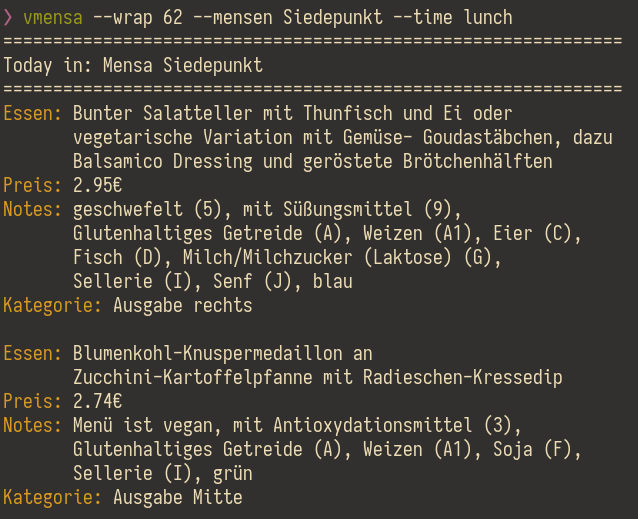

# vmensa

`vmensa` brings the mensa menus of the [TU Dresden][Studentenwerk API],
as well as the [University of Hamburg](https://www.stwhh.de/speiseplan)
to your command line.



For a quick overview of all command line options, see `vmensa --help`.
For more information, please consult the man page.

[Studentenwerk API]: https://www.studentenwerk-dresden.de/mensen/speiseplan-api.html

# Building

A nix flake is provided, though building should also work with just `cabal build` or `cabal install`.

There is also a small build script available, which takes case of
installing the man page as well; use at your own risk.  It expects the
path where it should move the executable to as an input.  For example,

``` console
  $ ./build ~/.local/bin/vmensa
```

will symlink the executable to `~/.local/bin/vmensa`.

# Examples

What follows are some examples, in increasing complexity, to help you
get a feel for what's possible.

``` console
$ vmensa

$ vmensa --mensen siedepunkt --wrap 62 --time lunch

$ vmensa --diet vegan --no-additives --sections name,notes --ikat Suppe

$ vmensa --no-additives --columns 4 --wrap 50 --sections name,price,notes \
> --ikat Suppe,Pasta,Terrine --mensen wu,siede,zelt,alte,bio
```

The output of the last command will be something along the lines of


For some more examples, refer to the man page.
